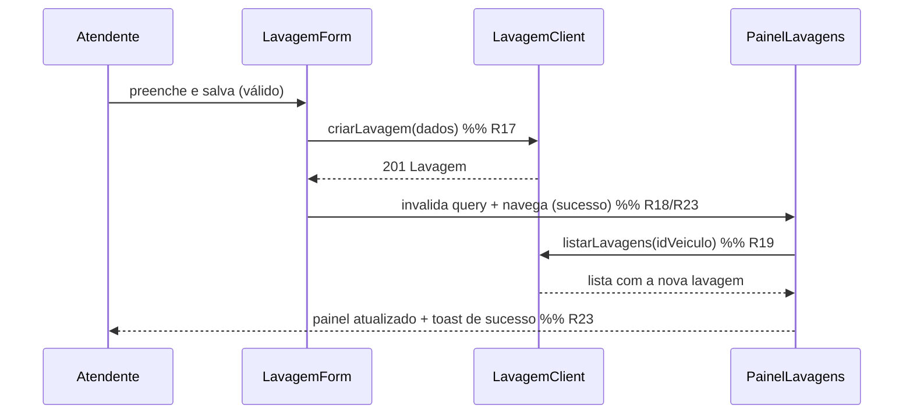

# Design — Frontend do Módulo de Lavagem

## Visão geral

Aplicação **React + Tailwind** (SPA) que implementa o fluxo do atendente:
abrir a tela de um veículo → ver o painel de lavagens → incluir/editar/excluir →
ver o resultado na própria tela. O frontend é uma camada fina sobre o contrato da
API `api-lavagens`; as regras condicionais (R09–R14) vêm do módulo compartilhado
`packages/dominio`, não são reimplementadas na UI.

Princípios de design:

- **Fonte única de regras.** Validação condicional reaproveita `packages/dominio`
  (mesmo módulo que roda na Lambda). A UI apenas liga/desliga campos e exibe erros.
- **Desacoplamento do backend.** Toda I/O passa por um `LavagemClient`; um
  `MockLavagemClient` permite demo e desenvolvimento sem AWS (Requisito 11).
- **Rastreabilidade.** Componentes e validações referenciam a Rxx em comentário,
  espelhando o gabarito (critério anti-alucinação).
- **Acessibilidade e responsividade** como requisito de projeto, não enfeite.

### Escopo e não-escopo

| No escopo | Fora de escopo (outros specs) |
|-----------|-------------------------------|
| UI React + Tailwind, estado, validação de cliente, camada de client/mock | Lambdas, DynamoDB, contador atômico (R01), checagem de FK no servidor (R05–R07) |
| Fluxo atendente R09–R23 na tela | IaC, Cognito real, Bedrock, leitura de recibo |
| Provider de auth mockável respeitando o contrato de sessão | Emissão/rotação de tokens |

As regras **R01, R05–R08, R16 (origem)** são responsabilidade do backend; o
frontend apenas as consome (ex.: exibe `KM_ATUAL`, nunca envia cadastrador).

## Stack e dependências

- **React 18** + **TypeScript** (tipagem do contrato, falha cedo — Req. 11.4).
- **Vite** como bundler (dev rápido; build para S3 + CloudFront).
- **Tailwind CSS** para estilo utilitário e responsividade.
- **React Router** para roteamento (veículo, formulário inclusão/edição).
- **React Hook Form** para estado de formulário + **resolver** que delega a
  validação ao `packages/dominio`.
- **TanStack Query** (react-query) para busca/mutação, cache e estados de
  loading/erro do painel (Req. 2.6/2.7, 8.6).
- `packages/dominio` (workspace interno) — regras R02–R04, R09–R15.

> Essas libs são a escolha padrão do ecossistema React para formulário e data
> fetching; mantêm o componente enxuto e os estados (loading/erro) explícitos.
> Se o time preferir, o resolver e o client podem ser escritos à mão sem mudar a
> arquitetura.

## Arquitetura de pastas (`web/`)

```
web/
  src/
    main.tsx                 # bootstrap, providers (Router, Query, Auth)
    app/
      router.tsx             # rotas protegidas
      providers.tsx          # QueryClient, AuthProvider, Toaster
    auth/
      AuthProvider.tsx       # contexto de sessão (token, usuário) — Req.1
      useAuth.ts
      LoginPage.tsx          # Req.1
      RequireAuth.tsx        # guard de rota — Req.1.1
    api/
      types.ts               # tipos do contrato (Lavagem, TipoLavagem, Posto, Veiculo)
      LavagemClient.ts       # interface do client — Req.11.1
      HttpLavagemClient.ts   # implementação HTTP (JWT no header) — Req.1.3
      MockLavagemClient.ts   # mock dos dados sintéticos — Req.11.2/11.3
      clientFactory.ts       # escolhe real/mock por env — Req.11.2
    features/veiculo/
      VeiculoPage.tsx        # tela do veículo (host do painel) — Req.2/3
      PainelLavagens.tsx     # lista + Km Atual + estados — Req.2
      LavagemRow.tsx         # linha com link de edição — Req.3.3
      useLavagens.ts         # query GET /veiculos/{id}/lavagens — Req.2.1
    features/lavagem/
      LavagemFormPage.tsx    # host inclusão/edição — Req.3/8/9
      LavagemForm.tsx        # campos + lógica condicional — Req.4/5/6/7
      useLavagemMutations.ts # create/update/delete — Req.8/9
      camposCondicionais.ts  # deriva visibilidade a partir das Rxx (usa dominio)
      ConfirmDeleteDialog.tsx# confirmação de exclusão — Req.9.2
    components/
      Field.tsx, Select.tsx, MoneyInput.tsx, DateInput.tsx  # inputs acessíveis — Req.10
      Toast.tsx, EmptyState.tsx, ErrorState.tsx, Spinner.tsx
    lib/
      format.ts              # data DD/MM/AAAA, moeda BRL — Req.2.3
      validationResolver.ts  # ponte React Hook Form ⇄ packages/dominio — Req.4.6
    mocks/
      dados-sinteticos.ts    # veículo 101 + tipos + postos + 1 lavagem — Req.11.3
  index.html
  tailwind.config.js
  vite.config.ts
```

## Modelo de dados (tipos do contrato)

Alinhados ao gabarito e aos dados sintéticos. Nomes em `camelCase` no frontend,
mapeados dos campos do contrato.

```ts
// api/types.ts
export type SimNao = 'S' | 'N';

export interface Veiculo {
  idVeiculo: number;
  descricao: string;
  kmAtual: number;        // R16 (referência, read-only)
}

export interface TipoLavagem {
  idTipoLavagem: number;
  descricao: string;      // DS_TIPO_LAVAGEM
}

export interface Posto {
  idPosto: number;
  nome: string;
}

export interface Lavagem {
  idLavagem?: number;        // ausente em inclusão (R01 no backend)
  idVeiculo: number;         // R02
  idTipoLavagem: number;     // R02, R05
  dtLavagem: string;         // ISO YYYY-MM-DD (R15)
  kmLavagem: number;         // R02, R04
  propriaUnidade: SimNao;    // R09 (default 'S')
  vlLavagem?: number;        // R03/R11 (externa)
  postoConveniado?: SimNao;  // R12 (default 'S' quando externa)
  idPosto?: number;          // R13
  dsPosto?: string;          // R14
  cnpjPosto?: string;        // R14
}
```

## Contrato do client (desacoplamento — Req. 11)

```ts
// api/LavagemClient.ts
export interface LavagemClient {
  listarLavagens(idVeiculo: number): Promise<Lavagem[]>;      // R19/R20
  obterVeiculo(idVeiculo: number): Promise<Veiculo>;          // R16 (KM_ATUAL)
  obterLavagem(id: number): Promise<Lavagem>;                 // R21 (edição)
  listarTipos(): Promise<TipoLavagem[]>;                      // Req.4.5
  listarPostos(): Promise<Posto[]>;                           // Req.6.6
  criarLavagem(dados: Lavagem): Promise<Lavagem>;             // R17 (POST)
  atualizarLavagem(id: number, dados: Lavagem): Promise<Lavagem>; // R17 (PUT)
  excluirLavagem(id: number): Promise<void>;                  // R17 (DELETE)
}
```

- `HttpLavagemClient` injeta o JWT da sessão em cada chamada (Req. 1.3) e, em 401,
  dispara o encerramento de sessão (Req. 1.4).
- `MockLavagemClient` opera sobre `mocks/dados-sinteticos.ts`, com veículo 101
  contendo ao menos uma lavagem (Req. 11.3) e simulando latência para exercitar
  os estados de loading/erro.
- `clientFactory.ts` lê `VITE_USE_MOCK` para escolher a implementação (Req. 11.2).

## Roteamento

| Rota | Componente | Modo | Regras |
|------|-----------|------|--------|
| `/login` | `LoginPage` | público | R-Req.1 |
| `/veiculos/:idVeiculo` | `VeiculoPage` → `PainelLavagens` | protegido | R16, R19–R23 |
| `/veiculos/:idVeiculo/lavagens/nova` | `LavagemFormPage` | inclusão | R22, R04–R15 |
| `/veiculos/:idVeiculo/lavagens/:idLavagem` | `LavagemFormPage` | edição | R21, R17 |

`RequireAuth` encapsula as rotas protegidas (Req. 1.1). Após salvar/excluir, a
navegação volta para `/veiculos/:idVeiculo` com flag de sucesso (R18/R23).

## Lógica condicional do formulário (coração — R09–R14)

A visibilidade e a obrigatoriedade dos campos são **derivadas** do estado atual,
e a validação é delegada ao domínio. Nenhum `if` de regra fica solto no JSX.

```ts
// features/lavagem/camposCondicionais.ts
export interface EstadoLavagem {
  propriaUnidade: SimNao;     // R09
  postoConveniado?: SimNao;   // R12
}

export function visibilidade(e: EstadoLavagem) {
  const externa = e.propriaUnidade === 'N';           // R09
  const conveniado = externa && e.postoConveniado !== 'N';
  return {
    valor: externa,                                   // R10/R11
    escolhaPostoConveniado: externa,                  // R12
    selecaoPosto: externa && conveniado,              // R13
    dsPosto: externa && !conveniado,                  // R14
    cnpjPosto: externa && !conveniado,                // R14
  };
}
```

- Ao alternar "Na própria unidade?" para Sim, os campos ocultos são **limpos** e
  seus erros descartados (Req. 5.5), e não entram no payload (Req. 8.3).
- Ao alternar "Posto conveniado?", limpamos o ramo que ficou oculto (Req. 6.7).
- A **validação de obrigatoriedade** (quais campos são exigidos por ramo) vem do
  `packages/dominio` via `validationResolver`, garantindo paridade com o backend.

### Ponte de validação (fonte única)

```ts
// lib/validationResolver.ts
import { validarLavagem } from '@sigfrota/dominio'; // R02–R04, R09–R15

// adapta o retorno { campo: mensagem } do domínio para o formato do React Hook Form
export const lavagemResolver = (valores) => {
  const erros = validarLavagem(valores); // regras R02–R04, R09–R15
  return toResolverResult(valores, erros);
};
```

> Se `packages/dominio` ainda não existir no momento da implementação do front,
> cria-se um **stub** com a mesma assinatura (`validarLavagem`) implementando
> R02–R04 e R09–R15, a ser substituído pelo módulo real. Isso mantém o
> desacoplamento sem bloquear o front.

## Mapeamento Requisito → Regra → Componente

| Regra | Onde vive no front | Requisito |
|-------|--------------------|-----------|
| R02 (obrigatórios) | `validationResolver` + `LavagemForm` | 4.2 |
| R03 (valor > 0) | `validationResolver` + `MoneyInput` | 4.4 |
| R04 (km > 0) | `validationResolver` | 4.3 |
| R09 (unidade/externa) | `camposCondicionais` + toggle | 5.1 |
| R10 (interna dispensa) | `visibilidade` + payload | 5.2, 8.3 |
| R11 (valor externo) | `camposCondicionais` + resolver | 5.3/5.4 |
| R12 (conveniado?) | `camposCondicionais` | 6.1 |
| R13 (seleção posto) | `visibilidade` + resolver | 6.2/6.3 |
| R14 (ds+cnpj) | `visibilidade` + resolver | 6.4/6.5 |
| R15 (data válida) | `DateInput` + resolver | 7.1 |
| R16 (Km Atual) | `PainelLavagens` (read-only) | 2.8 |
| R17 (CRUD) | `useLavagemMutations` | 8/9 |
| R18 (volta + msg) | `LavagemFormPage` → navigate + Toast | 8.4/9.3 |
| R19/R20 (lista) | `useLavagens` + `PainelLavagens` | 2.1–2.3 |
| R21 (link edição) | `LavagemRow` | 3.3 |
| R22 (incluir) | `PainelLavagens` botão | 3.1/3.2 |
| R23 (resultado na tela) | invalidação de query após mutação | 8.5 |

## Fluxo "ver o resultado na tela" (R23)

1. `LavagemForm` envia `criarLavagem` via `useLavagemMutations`.
2. No sucesso, invalida a query `['lavagens', idVeiculo]` (TanStack Query).
3. Navega para `/veiculos/:idVeiculo` com estado `{ sucesso: true }`.
4. `PainelLavagens` refaz o fetch (cache invalidado) e renderiza a lista com a
   nova lavagem; `Toast` mostra sucesso (R18/R23).



## Formatação e apresentação

- **Data:** armazenada/enviada em ISO `YYYY-MM-DD`; exibida em `DD/MM/AAAA`
  (`lib/format.ts`) — Req. 2.3, 7.2.
- **Moeda:** `Intl.NumberFormat('pt-BR', { style:'currency', currency:'BRL' })`;
  lavagem interna exibe "—" (Req. 2.4).
- **Km:** inteiro com separador de milhar pt-BR.

## Estados de UI

| Estado | Tratamento | Requisito |
|--------|-----------|-----------|
| Carregando lista | skeleton/spinner | 2.6 |
| Lista vazia | `EmptyState` com CTA incluir | 2.5 |
| Erro de busca | `ErrorState` + "tentar novamente" | 2.7 |
| Salvando | botão desabilitado + spinner | 8.6 |
| Erro ao salvar | mantém dados + toast de erro | 8.7 |
| Confirmação de exclusão | `ConfirmDeleteDialog` | 9.2 |
| Sessão expirada (401) | logout + redireciona login | 1.4 |

## Acessibilidade e responsividade (Req. 10)

- Inputs reutilizáveis (`Field`, `Select`, `DateInput`, `MoneyInput`) com `label`
  associado, `aria-invalid` e mensagem de erro vinculada por `aria-describedby`.
- Toda a interação disponível por teclado; foco gerenciado ao abrir o diálogo de
  exclusão e ao navegar entre painel e formulário.
- Tailwind com breakpoints: coluna única em telas estreitas (tablet), duas
  colunas no desktop para o formulário.
- Contraste alvo WCAG AA. Observação: conformidade WCAG completa requer teste
  manual com tecnologias assistivas e revisão de acessibilidade — fora do MVP.

## Segurança no cliente (apoia critério 4 / LGPD)

- JWT nunca em `localStorage` sem necessidade; preferir memória + refresh via
  provider (decisão a confirmar com o spec `infra-base`).
- CNPJ e demais dados sensíveis **não** são logados no console (Req. 10.6).
- Cadastrador (R08) nunca é campo do formulário — vem do token no backend.
- O frontend valida entrada, mas a validação servidora é a autoridade; o cliente
  não confia apenas em si.

## Estratégia de testes

Testes com **Vitest + React Testing Library** (padrão Vite/React), espelhando os
casos do gabarito (§5 de `lavagem-gabarito-regras.md`):

| Caso do gabarito | Teste de front |
|------------------|----------------|
| Feliz interna | interna não exige valor/posto; payload sem esses campos (R10) |
| Feliz conveniado | externa+conveniado exige `idPosto`; envia valor (R11/R13) |
| Feliz não conveniado | externa+não conv. exige `dsPosto`+`cnpj` (R14) |
| Erro km zero | bloqueia envio, erro no campo km (R04) |
| Erro valor zero externo | bloqueia, erro no valor (R03/R11) |
| Erro externo sem valor | bloqueia, erro no valor (R11) |
| Erro conveniado sem posto | bloqueia, erro na seleção (R13) |
| Erro não conv. sem CNPJ | bloqueia, erro no CNPJ (R14) |
| Erro data inválida | bloqueia, erro na data (R15) |
| Listagem por veículo | painel do 101 lista só o 101, ordenado por data (R19/R20) |
| Resultado na tela | após incluir, a lista exibe a nova lavagem (R23) |

Cada teste referencia a Rxx no nome/descrição (rastreabilidade). A alternância de
visibilidade (R09–R14) é testada em `camposCondicionais` isoladamente.

## Decisões e simplificações registradas

1. **Km Atual via mock.** No MVP o `KM_ATUAL` vem do contrato (origem mock
   `FR_VEICULO_MOCK`), não de `FR_ATENDIMENTO` (R16). Decisão herdada do gabarito.
2. **Regras no domínio.** O front não reimplementa R02–R04/R09–R15; delega a
   `packages/dominio`. Se indisponível, usa stub de mesma assinatura.
3. **Mock-first.** Desenvolvimento e demo funcionam com `MockLavagemClient`;
   troca para HTTP por env, sem tocar componentes (Req. 11.2).
4. **Auth abstraída.** Provider de sessão mockável; integração Cognito real
   pertence a `infra-base`.
5. **Libs de formulário/data.** React Hook Form + TanStack Query são sugestões
   padrão; substituíveis sem mudar a arquitetura de camadas.
